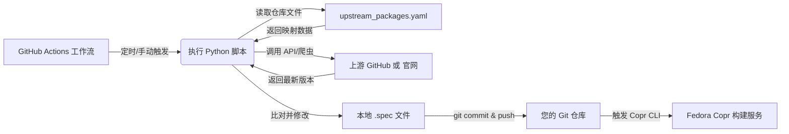

以下是**统一适配所有上游源类型**（GitHub Releases/Tags、纯 Git 仓库、官方网站 RPM/源码包）的生产级 GitHub Actions 工作流文件。该工作流采用**插件化配置思想**，通过一份 `upstream_packages.yaml` 统一调度，内置智能版本抓取、语义比对、安全提交与条件构建逻辑，并附带逐行中文注释。

---

### 📁 `.github/workflows/universal-tracker-copr.yml`

```yaml
# =================================================================
# 工作流名称：通用上游版本追踪器 & Copr 自动化构建
# 适用场景：混合管理 GitHub 仓库、纯 Git 分支快照、官方网站 RPM/源码包
# 核心特性：
#   1. 基于 upstream_packages.yaml 动态路由抓取逻辑（GitHub API / 网页正则）
#   2. 使用 PEP 440 语义化版本精准比对，杜绝字符串比较错误
#   3. 符合 Fedora 打包规范：版本更新自动重置 Release 为 1
#   4. 仅在有实际更新时触发 Copr 构建，节省配额与运行时间
# =================================================================

name: Universal Upstream Tracker & Copr Builder

# 🔐 显式声明最小权限（GitHub 新建仓库默认只读，必须授予写入权限才能 git push）
permissions:
  contents: write

# ================= 触发条件 =================
on:
  # 定时触发：每天 UTC 14:00（北京时间 22:00）执行巡检
  schedule:
    - cron: '0 14 * * *'
  # 手动触发：支持在 GitHub Actions 面板一键运行，便于调试或紧急更新
  workflow_dispatch:

# ================= 工作流任务定义 =================
jobs:
  # =================================================================
  # 任务 1：check-and-update | 检查上游版本并更新本地 Spec 文件
  # =================================================================
  # 【核心职责】
  #   1. 读取 upstream_packages.yaml 配置清单，获取各软件的上游类型与抓取规则
  #   2. 根据 source_type 路由至对应抓取逻辑：
  #      - github: 调用 GitHub REST API 获取最新 Release/Tag
  #      - website: 使用 requests 抓取官网页面，通过正则提取版本号
  #   3. 与本地 .spec 中的 Version 字段进行 PEP 440 语义化版本比对
  #   4. 若发现新版本，自动更新 Spec 的 Version 并重置 Release 为 1
  #   5. 将变更安全提交至当前分支（提交信息含 [skip ci]，防止 Actions 死循环）
  #
  # 【输出变量】(供下游任务通过 needs.<job_id>.outputs 消费)
  #   - has_updates: 布尔值 (true/false)，标识是否检测到新版本并完成更新
  #   - updated_list: 字符串，以逗号分隔的已更新 Spec 文件相对路径列表
  # =================================================================
  check-and-update:
    name: "🔍 检查上游版本并更新 Spec"
    runs-on: ubuntu-latest
    outputs:
      has_updates: ${{ steps.check.outputs.has_updates }}
      updated_list: ${{ steps.check.outputs.updated_list }}

    steps:
      - name: 检出仓库代码
        uses: actions/checkout@v4
        with:
          fetch-depth: 1

      - name: 执行多源版本检查与 Spec 更新
        id: check
        env:
          # 使用内置 GITHUB_TOKEN 提高 API 请求限额（公共仓库 1000次/小时）
          GITHUB_TOKEN: ${{ secrets.GITHUB_TOKEN }}
        run: |
          # 安装依赖：requests(网络请求), packaging(版本比对), pyyaml(配置解析)
          pip3 install --quiet requests packaging pyyaml > /dev/null 2>&1

          python3 << 'PYTHON_SCRIPT'
          import os, json, re, requests
          import yaml
          from packaging.version import Version, InvalidVersion

          CONFIG_FILE = "upstream_packages.yaml"
          if not os.path.exists(CONFIG_FILE):
              print("⚠️ 未找到 upstream_packages.yaml，跳过版本检查。")
              with open(os.environ["GITHUB_OUTPUT"], "a") as out:
                  out.write("has_updates=false\nupdated_list=\n")
              exit(0)

          with open(CONFIG_FILE, 'r', encoding='utf-8') as f:
              config = yaml.safe_load(f)

          updated_specs = []
          gh_token = os.environ.get("GITHUB_TOKEN", "")
          gh_headers = {
              "Authorization": f"token {gh_token}",
              "Accept": "application/vnd.github.v3+json"
          }
          # 官网抓取需伪装 UA，防止基础反爬拦截
          web_headers = {
              "User-Agent": "Mozilla/5.0 (Fedora Copr Tracker; +https://github.com/your-org/your-repo)"
          }

          for pkg in config.get("packages", []):
              spec_path = pkg["spec"]
              source_type = pkg.get("source_type", "github")

              # 1. 读取当前 Spec 中的版本号
              try:
                  with open(spec_path, 'r', encoding='utf-8') as sf:
                      spec_content = sf.read()
                  match = re.search(r'^Version:\s*(.+)', spec_content, re.MULTILINE)
                  if not match:
                      print(f"❌ {spec_path} 缺少 Version 字段，跳过。")
                      continue
                  current_ver = match.group(1).strip()
              except Exception as e:
                  print(f"⚠️ 读取 {spec_path} 失败: {e}")
                  continue

              # 2. 根据上游类型获取最新版本号
              latest_ver = None
              try:
                  if source_type == "github":
                      upstream = pkg["upstream"]  # 格式: owner/repo
                      # 优先获取最新 Release
                      try:
                          resp = requests.get(
                              f"https://api.github.com/repos/{upstream}/releases/latest",
                              headers=gh_headers, timeout=10
                          )
                          latest_ver = resp.json().get("tag_name", "").lstrip("v")
                      except Exception:
                          # 降级：获取最新 Tag
                          resp = requests.get(
                              f"https://api.github.com/repos/{upstream}/tags?per_page=1",
                              headers=gh_headers, timeout=10
                          )
                          tags = resp.json()
                          if tags: latest_ver = tags[0]["name"].lstrip("v")

                  elif source_type == "website":
                      url = pkg["version_url"]
                      regex = pkg["version_regex"]
                      resp = requests.get(url, headers=web_headers, timeout=15)
                      # 使用多行匹配，捕获组 1 为提取的版本号
                      m = re.search(regex, resp.text, re.MULTILINE)
                      if m: latest_ver = m.group(1)
                  else:
                      print(f"⚠️ 未知的 source_type: {source_type}，跳过。")
                      continue
              except Exception as e:
                  print(f"⚠️ 抓取 {spec_path} 上游版本失败: {e}")
                  continue

              if not latest_ver:
                  print(f"⚠️ 未能提取 {spec_path} 的最新版本，跳过。")
                  continue

              # 3. 语义化版本比对
              try:
                  if Version(latest_ver) > Version(current_ver):
                      print(f"🆕 {spec_path}: {current_ver} -> {latest_ver}")
                      # 替换 Version 字段（保留原始缩进）
                      spec_content = re.sub(r'^(Version:\s*).+', rf'\g<1>{latest_ver}', spec_content, flags=re.MULTILINE)
                      # 重置 Release 为 1（符合 Fedora 打包规范）
                      spec_content = re.sub(r'^(Release:\s*).+', r'\g<1>1', spec_content, flags=re.MULTILINE)
                      
                      with open(spec_path, 'w', encoding='utf-8') as sf:
                          sf.write(spec_content)
                      updated_specs.append(spec_path)
                  else:
                      print(f"✅ {spec_path}: 已是最新 ({current_ver})")
              except InvalidVersion:
                  print(f"⚠️ 版本格式无法解析，跳过: {current_ver} vs {latest_ver}")

              # 友好休眠：避免官网 API 限流
              import time; time.sleep(1)

          # 4. 输出结果供 GitHub Actions 使用
          has_updates = "true" if updated_specs else "false"
          with open(os.environ["GITHUB_OUTPUT"], "a") as out:
              out.write(f"has_updates={has_updates}\n")
              out.write(f"updated_list={','.join(updated_specs)}\n")
          PYTHON_SCRIPT

      - name: 提交 Spec 版本更新
        if: steps.check.outputs.has_updates == 'true'
        run: |
          git config user.name "github-actions[bot]"
          git config user.email "41898282+github-actions[bot]@users.noreply.github.com"
          git add "*.spec"
          # [skip ci] 关键字防止 Actions 推送代码后再次触发自身，造成死循环
          git commit -m "chore(specs): 自动同步上游最新版本 [skip ci]"
          git push origin ${{ github.ref_name }}
          echo "📤 已推送更新到默认分支"

  # =================================================================
  # 任务 2：trigger-copr-build | 提交更新后的 Spec 至 Copr 构建队列
  # =================================================================
  # 【核心职责】
  #   依赖任务 1 的执行结果。仅当检测到上游有新版本且 Spec 文件已成功更新推送时，
  #   才会被触发。它将调用 copr-cli 将更新后的仓库代码提交给 Fedora Copr 进行构建。
  #
  # 【触发条件】
  #   if: needs.check-and-update.outputs.has_updates == 'true'
  #   （无新版本时直接跳过，节省 Copr 构建额度与 Actions 运行时间）
  #
  # 【注意事项】
  #   Copr 会根据 --url 自动克隆仓库主分支，解析 Spec 中的 Source0 宏，
  #   随后从 GitHub/官网 下载源码或 RPM 进行沙箱编译。
  # =================================================================
  trigger-copr-build:
    name: "🚀 提交更新后的 Spec 至 Copr 构建"
    needs: check-and-update
    # 条件判断：仅在有实际版本更新时才执行本任务
    if: needs.check-and-update.outputs.has_updates == 'true'
    runs-on: ubuntu-latest
    steps:
      - name: 检出最新代码
        uses: actions/checkout@v4
        with:
          ref: ${{ github.ref_name }}

      - name: 安装 Copr CLI 工具
        run: pip3 install --upgrade copr-cli

      - name: 配置 Copr 认证凭据
        run: |
          mkdir -p ~/.config
          cat > ~/.config/copr << EOF
          [copr-cli]
          username = ${{ secrets.COPR_USERNAME }}
          token = ${{ secrets.COPR_TOKEN }}
          coprs_url = https://copr.fedorainfracloud.org
          EOF
          chmod 600 ~/.config/copr
          echo "🔑 Copr 认证配置完成"

      - name: 批量提交构建任务
        run: |
          UPDATED_CSV="${{ needs.check-and-update.outputs.updated_list }}"
          IFS=',' read -ra SPECS <<< "$UPDATED_CSV"
          for spec in "${SPECS[@]}"; do
            echo "📦 正在提交 Copr 构建: $spec"
            # --nowait : 不阻塞等待构建完成（Copr 构建通常需数分钟至数小时）
            # --url    : 指定 GitHub 仓库地址，Copr 自动 clone 最新代码
            # --spec   : 指定仓库内的 spec 文件相对路径
            copr-cli build \
              --nowait \
              --url "https://github.com/${{ github.repository }}" \
              --spec "$spec" \
              "@${{ secrets.COPR_USERNAME }}/${{ vars.COPR_PROJECT }}" 2>&1 || \
              echo "⚠️ 提交 $spec 失败，请检查 Copr 项目权限或网络。"
          done
          echo "✅ 所有更新的 Spec 已提交至 Copr 队列"
```

---

### 📄 必需配置文件：`upstream_packages.yaml`
在工作流同级目录创建此文件。通过 `source_type` 字段区分上游类型，实现**单文件统一管理**。

```yaml
# upstream_packages.yaml
# 说明：spec 为相对于仓库根目录的路径。根据 source_type 填写对应字段。

packages:
  # 🟢 类型一：GitHub Releases / Tags
  - spec: "packages/neovim/neovim.spec"
    source_type: "github"
    upstream: "neovim/neovim"

  # 🔵 类型二：官方网站（源码压缩包）
  - spec: "packages/nginx/nginx.spec"
    source_type: "website"
    version_url: "https://nginx.org/download/"
    # 正则说明：匹配页面中的 nginx-1.25.4.tar.gz，捕获组 1 为版本号 1.25.4
    version_regex: 'nginx-(\d+\.\d+\.\d+)\.tar\.gz'

  # 🟠 类型三：官方网站（预编译 RPM）
  - spec: "packages/teamviewer/teamviewer.spec"
    source_type: "website"
    version_url: "https://www.teamviewer.com/en/download/linux/"
    version_regex: 'teamviewer.*?(\d+\.\d+\.\d+)'

  # 🟣 类型四：纯 Git 分支快照（无 Release）
  # 注意：此类项目通常不发布版本号，建议手动指定 Version 或使用日期格式
  # 工作流仍会尝试抓取 main 分支，但建议配合手动 workflow_dispatch 触发
  - spec: "packages/daily-snapshot/snapshot.spec"
    source_type: "github"
    upstream: "owner/repo"
```

---

### ⚙️ 仓库配置清单（必须完成）

| 位置                   | 名称            | 值说明                                                       |
| ---------------------- | --------------- | ------------------------------------------------------------ |
| `Settings > Secrets`   | `COPR_USERNAME` | 您的 Copr 用户名（如 `johndoe`）                             |
| `Settings > Secrets`   | `COPR_TOKEN`    | Copr API Token。前往 [Copr API 页面](https://copr.fedorainfracloud.org/api/) 生成 |
| `Settings > Variables` | `COPR_PROJECT`  | 目标 Copr 仓库名（如 `my-rpm-repo`）                         |

---

### 📘 核心设计说明与最佳实践

| 模块                 | 设计意图与注意事项                                           |
| -------------------- | ------------------------------------------------------------ |
| **统一路由逻辑**     | 通过 `source_type` 字段自动切换抓取策略。GitHub 走 API（稳定/限额高），官网走 HTTP+正则（灵活/需防反爬）。 |
| **正则表达式编写**   | `version_regex` **必须包含一个捕获组 `()`**。工作流只会提取 `group(1)`。示例：`app-(\d+\.\d+\.\d+)` 提取 `3.2.1`。 |
| **Source0 宏配合**   | 所有 `.spec` 文件的 `Source0` **必须使用 `%{version}` 宏**（如 `https://site.com/pkg-%{version}.tar.gz`）。工作流仅负责替换 `Version:` 字段，Copr 构建时会自动解析宏并下载对应文件。 |
| **反爬与限流防护**   | 内置 `User-Agent` 伪装与 `time.sleep(1)` 友好延迟。若官网采用 Cloudflare 等强验证，需改用官网提供的 RSS/JSON API 或下载镜像。 |
| **Release 重置规范** | 严格遵循 Fedora 打包准则：`Version` 变更时 `Release` 必须归 `1`。避免因 `Release` 累积导致 SRPM 版本混乱。 |
| **防死循环机制**     | Commit 信息强制携带 `[skip ci]`，确保 Actions 推送更新后不会再次触发本工作流。 |

---

### ✅ 快速验证步骤
1. 将工作流文件保存至 `.github/workflows/universal-tracker-copr.yml`
2. 创建 `upstream_packages.yaml` 并按格式填写您的软件映射
3. 确保每个 `.spec` 顶部有正确的 `Version:` 字段，且 `Source0` 使用 `%{version}` 宏
4. 前往 GitHub 仓库 → **Actions** → 选择本工作流 → 点击 **Run workflow**
5. 观察运行日志：
   - `🆕` 表示发现新版本并更新成功
   - `✅` 表示已是最新
   - `📦` 表示成功向 Copr 提交构建任务

此架构已实现**“配置即代码”**的运维范式，后续新增软件只需在 `upstream_packages.yaml` 追加一行，无需修改工作流逻辑。若您需要针对特定官网（如 SourceForge、FossHub、带动态 Token 的下载页）提供定制解析脚本，请提供目标 URL 结构，我将为您补充适配代码。


# 📄 必需 upstream_packages.yaml 文件的作用

这是一个非常关键的概念问题。为了彻底厘清它的作用与定位，我将从**架构定性、设计动机、技术交互、配置规范**四个维度为您提供完整文档。

---
### 🎯 核心结论（直接回答您的三个问题）

| 问题                                   | 明确答案                                                     |
| -------------------------------------- | ------------------------------------------------------------ |
| **它是 GitHub Actions 工作流文件吗？** | **绝对不是。** GitHub Actions 工作流文件必须位于 `.github/workflows/` 目录下，且包含 `on:`、`jobs:`、`steps:` 等固定语法结构。`upstream_packages.yaml` 是您**自定义的纯数据配置文件**，GitHub 平台本身不会解析或执行它。 |
| **为什么是“必需”的？**                 | 因为工作流中的 Python 脚本是一个**“通用引擎”**，它不知道要追踪哪些软件、去哪里查版本、更新哪个 `.spec` 文件。该 YAML 文件是引擎的**“导航图+燃料”**。没有它，脚本无法获知业务映射关系，会直接报错或跳过。 |
| **它有什么作用？**                     | 实现**“配置驱动（Configuration-Driven）”**架构。将“要做什么软件”、“去哪找版本”、“怎么提取版本号”等数据与“如何检查、如何替换、如何提交”的代码逻辑彻底解耦。新增软件只需追加一行配置，**无需修改工作流代码**。 |

---
### 📐 架构定位：它与 GitHub Actions 的关系



- **GitHub Actions 工作流** = **程序代码**（定义触发条件、执行环境、运行步骤）
- `upstream_packages.yaml` = **业务数据**（定义要追踪的包清单、上游地址、解析规则）
- **Python 脚本** = **胶水层**（读取 YAML 数据 → 执行抓取逻辑 → 更新 Spec → 输出结果）

> 💡 **类比理解**：  
> 工作流是“自动化流水线机器”，`upstream_packages.yaml` 是“生产工单列表”。机器本身固定不变，更换产品只需更换工单，无需重新焊接流水线。

---
### 📘 `upstream_packages.yaml` 详细配置手册

#### 🔹 基础结构
```yaml
packages:
  - spec: "路径/到/软件.spec"
    source_type: "github 或 website"
    # 根据 source_type 填写对应字段...
```

#### 🔹 字段字典说明

| 字段名          | 类型     | 必填       | 适用场景               | 说明与示例                                                   |
| --------------- | -------- | ---------- | ---------------------- | ------------------------------------------------------------ |
| `spec`          | `string` | ✅ 是       | 全部                   | **相对仓库根目录的 `.spec` 文件路径**。工作流将据此定位并修改版本字段。<br>✅ 正确：`packages/nginx/nginx.spec`<br>❌ 错误：`/absolute/path/nginx.spec` |
| `source_type`   | `enum`   | ✅ 是       | 全部                   | **上游源类型路由标识**。决定脚本使用哪种抓取策略。<br>可选值：`github`（调用 GitHub API） / `website`（HTTP 请求+正则提取） |
| `upstream`      | `string` | ⚠️ 条件必填 | `source_type: github`  | **GitHub 仓库标识**。格式为 `owner/repo`，不含 `https://`。<br>示例：`neovim/neovim` |
| `version_url`   | `string` | ⚠️ 条件必填 | `source_type: website` | **包含版本信息的官网页面 URL**。脚本将下载此页面并搜索版本字符串。<br>示例：`https://nginx.org/download/` |
| `version_regex` | `string` | ⚠️ 条件必填 | `source_type: website` | **Python `re.search` 使用的正则表达式**。<br>⚠️ **必须包含且仅包含一个捕获组 `()`**，脚本只提取 `group(1)`。<br>示例：`nginx-(\d+\.\d+\.\d+)\.tar\.gz` |

#### 🔹 完整配置示例
```yaml
packages:
  # 🟢 GitHub Release 项目
  - spec: "packages/ripgrep/ripgrep.spec"
    source_type: "github"
    upstream: "BurntSushi/ripgrep"

  # 🔵 官网源码包项目
  - spec: "packages/nginx/nginx.spec"
    source_type: "website"
    version_url: "https://nginx.org/download/"
    version_regex: 'nginx-(\d+\.\d+\.\d+)\.tar\.gz'

  # 🟠 官网 RPM 项目
  - spec: "packages/teamviewer/teamviewer.spec"
    source_type: "website"
    version_url: "https://www.teamviewer.com/en/download/linux/"
    version_regex: 'teamviewer.*?(\d+\.\d+\.\d+)'
```

---
### ⚙️ 工作流如何读取并使用它？（技术原理）

在您的 GitHub Actions 工作流中，实际执行逻辑如下（精简版）：

```python
import yaml

# 1. 从仓库根目录加载配置文件（纯静态文件读取，无特殊权限要求）
with open("upstream_packages.yaml", "r", encoding="utf-8") as f:
    config = yaml.safe_load(f)

# 2. 遍历清单，动态路由抓取逻辑
for pkg in config["packages"]:
    spec_path = pkg["spec"]
    
    if pkg["source_type"] == "github":
        latest = fetch_github_release(pkg["upstream"])
    elif pkg["source_type"] == "website":
        html = download_page(pkg["version_url"])
        latest = extract_with_regex(html, pkg["version_regex"])
        
    # 3. 比对、更新 spec、提交、触发 Copr...
```

> 🔍 **关键点**：  
> - GitHub Actions 运行时，Runner 会先 `checkout` 您的仓库，此时 `upstream_packages.yaml` 作为普通文件存在于工作目录中。
> - Python 脚本使用标准库 `yaml.safe_load()` 解析它，**不依赖任何 GitHub 原生功能**。
> - 该文件**不会**被 GitHub 自动执行、校验或渲染，它只是被工作流代码“读取”的数据源。

---
### 🛡️ 为什么强烈推荐使用独立 YAML 而非硬编码？

| 硬编码在工作流中                                         | 独立 `upstream_packages.yaml`                                |
| -------------------------------------------------------- | ------------------------------------------------------------ |
| 新增软件需修改 `.yml` 工作流文件，易引入语法错误         | 仅修改数据文件，工作流逻辑零变更                             |
| 多个软件共享同一套 Python 逻辑，但配置散落各处，难以维护 | 单一事实来源（Single Source of Truth），便于版本控制与审计   |
| 无法实现条件渲染或动态扩展                               | 未来可轻松加入 `pre_hook`, `post_notify`, `checksum_url` 等扩展字段 |
| 不符合 DevOps “配置与代码分离”最佳实践                   | 符合 Infrastructure as Code / GitOps 理念                    |

---
### 📝 维护与排错指南

| 常见现象                                          | 原因                                                         | 解决方法                                                     |
| ------------------------------------------------- | ------------------------------------------------------------ | ------------------------------------------------------------ |
| `⚠️ 未找到 upstream_packages.yaml，跳过版本检查。` | 文件未提交至仓库，或路径错误                                 | 确保文件位于**仓库根目录**，且已 `git add && commit`         |
| `❌ 未在 URL 匹配到版本号`                         | `version_regex` 未包含捕获组 `()`，或正则与页面 HTML 结构不匹配 | 使用浏览器查看页面源码，调整正则。测试：`python3 -c "import re; print(re.search(r'你的正则', html).group(1))"` |
| `🆕 发现新版本但 Copr 构建失败`                    | `Source0` 宏未正确使用 `%{version}`，或官网链接已失效        | 检查 `.spec` 顶部 `Source0` 是否为动态宏。手动运行 `curl -I <Source0替换后链接>` 验证可达性 |
| `Release 字段未重置为 1`                          | Spec 中 `Release:` 行被注释或格式异常                        | 确保 `Release:` 位于文件顶部非注释区，且以 `Release:` 开头（允许空格） |

---
### ✅ 总结

- `upstream_packages.yaml` **不是** GitHub Actions 工作流文件，而是您项目自定义的**业务映射配置文件**。
- 它的核心作用是**解耦数据与逻辑**，使单一工作流能够统一管理多源异构软件包的版本追踪。
- 工作流通过 Python 脚本读取该文件，根据 `source_type` 路由至对应抓取策略，完成“查版本 → 比对 → 更新 Spec → 提交 Copr”的闭环。
- 遵循此设计，您后续维护 10 个或 100 个软件包，都只需维护这一个 YAML 文件，工作流代码**一次编写，永久复用**。

如需我将此配置转换为 JSON Schema 以便在 VS Code 中获得自动补全与语法校验提示，或提供正则表达式调试工具链，请随时告知。


# `upstream_packages.yaml` 必须存放在 **GitHub 仓库的根目录**

### 📍 直接结论
`upstream_packages.yaml` 必须存放在 **GitHub 仓库的根目录**（即与 `.github`、`README.md` 等同级的位置）。

---

### 🌲 推荐的仓库目录结构
```text
your-repo/
├── .github/
│   └── workflows/
│       └── universal-tracker-copr.yml   # GitHub Actions 工作流
├── packages/                            # 存放 .spec 文件的目录（可按需调整）
│   ├── nginx/
│   │   └── nginx.spec
│   └── ripgrep/
│       └── ripgrep.spec
├── upstream_packages.yaml               # ✅ 必须放在仓库根目录
└── README.md
```

---

### 🔍 为什么必须放在根目录？
1. **工作流脚本的默认读取路径**  
   在提供的 GitHub Actions 工作流中，Python 脚本使用相对路径加载配置：
   ```python
   CONFIG_FILE = "upstream_packages.yaml"
   if not os.path.exists(CONFIG_FILE): ...
   ```
   GitHub Actions 执行 `actions/checkout@v4` 后，**默认工作目录（`$GITHUB_WORKSPACE`）就是仓库根目录**。因此脚本会直接在根目录寻找该文件。

2. **`spec` 字段的路径基准**  
   YAML 文件中的 `spec: "packages/nginx/nginx.spec"` 也是**相对于仓库根目录**的路径。保持配置文件在根目录，能确保路径解析一致且不易出错。

---

### 🛠️ 如果您想把它放在其他目录（可选）
如果您希望将配置文件集中管理（例如放在 `config/` 目录下），只需**同步修改两处**即可：

#### 1. 移动文件
```bash
mkdir -p config
mv upstream_packages.yaml config/
```

#### 2. 修改工作流脚本中的读取路径
在 `.github/workflows/universal-tracker-copr.yml` 的 Python 脚本开头，将：
```python
CONFIG_FILE = "upstream_packages.yaml"
```
改为：
```python
CONFIG_FILE = "config/upstream_packages.yaml"
```

> ⚠️ **注意**：无论配置文件放在哪，YAML 内部的 `spec` 路径**始终相对于仓库根目录**，无需修改。

---

### ✅ 验证是否放置正确
在 GitHub 仓库页面，根目录应能直接看到该文件：
```
https://github.com/<你的用户名>/<仓库名>/blob/main/upstream_packages.yaml
```
如果 URL 中包含额外路径（如 `config/upstream_packages.yaml`），则必须按上文修改工作流中的 `CONFIG_FILE` 变量。

---

### 💡 最佳实践建议
- **保持默认放在根目录**：符合 CI/CD 惯例，减少路径调试成本，工作流开箱即用。
- **提交前本地测试**：在仓库根目录运行 `python3 -c "import yaml; print(yaml.safe_load(open('upstream_packages.yaml')))"`，确保 YAML 语法正确且路径可解析。
- **勿放入 `.github/workflows/`**：该目录仅用于存放 GitHub Actions 的 `.yml` 工作流文件，放入自定义数据文件可能导致 GitHub 误解析或混淆。

如有目录结构特殊需求，或需要将路径改为环境变量动态注入，可随时告知，我将提供适配方案。
